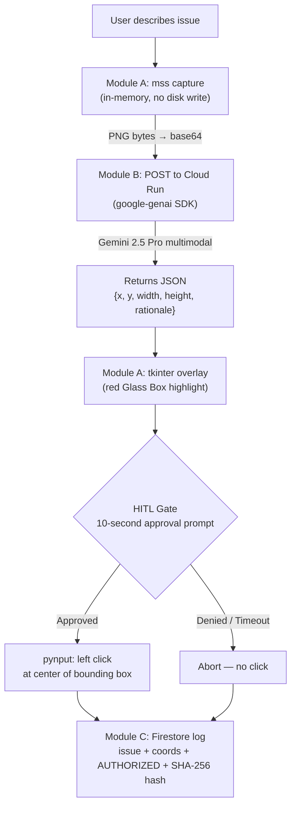

# Glass Box IT Agent

> A multimodal, Human-in-the-Loop (HITL) UI Navigator for Level 1 IT support.  
> Built for the **Gemini Live Agent Challenge**.

> ⚠️ **Windows-only demo.** The HITL input layer (`msvcrt`) and coordinate system are Windows-specific. macOS/Linux ports are not in scope for this submission.

---

## Elevator Pitch

Glass Box is a transparent AI support agent: it captures your screen, uses **Gemini 2.5 Pro** (via Cloud Run) to identify the exact UI element that resolves your issue, draws a red "glass box" highlight around it, explains its reasoning in plain English — and then **waits for your explicit approval** before touching your mouse.

---

## Architecture at a Glance

```
┌─────────────────────────────────────────────────────────┐
│                     EDGE CLIENT (Windows)               │
│                                                         │
│  mss capture (in-memory) ──► base64 encode ──► POST     │
│                                                  │      │
│  tkinter overlay ◄── coords ◄────────────────────┘      │
│       │                                                  │
│  HITL Gate (10-sec prompt) ──► pynput click              │
│       │                                                  │
│  Firestore log (issue + coords + approve/deny + hash)   │
└─────────────────────────────────────────────────────────┘
                          │ HTTPS POST (image_b64 + issue)
                          ▼
┌─────────────────────────────────────────────────────────┐
│              CLOUD RUN BRAIN (Google Cloud)             │
│                                                         │
│  google-genai SDK ──► Gemini 2.5 Pro multimodal         │
│  Returns: { x, y, width, height, element, rationale }  │
└─────────────────────────────────────────────────────────┘
```

### Mermaid diagram



### Diagram sources

- Source: `docs/architecture.mmd`
- Rendered image (commit for Devpost gallery/upload): `docs/architecture.png`

Render locally (no repo dependency required; uses one-time `npx`):

```bash
npx @mermaid-js/mermaid-cli mmdc -i docs/architecture.mmd -o docs/architecture.png
```


### Module map

| Module | File | Responsibility |
|--------|------|----------------|
| A | `src/module_a_vision.py` | `mss` in-memory capture · `tkinter` Glass Box overlay |
| B | `src/module_b_brain.py` | HTTP client → Cloud Run · validates coordinate response |
| C | `src/module_c_cloud.py` | Firestore audit log · deterministic SHA-256 integrity hash |
| D | `src/module_d_controller.py` | Orchestrator · HITL gate · `pynput` click execution |
| Cloud | `cloud_backend/main.py` | Flask + `google-genai` · Gemini 2.5 Pro inference |

---

## Tech Stack

| Layer | Technology |
|-------|-----------|
| AI Model | Gemini 2.5 Pro (`gemini-2.5-pro`) |
| AI SDK | `google-genai` Python SDK |
| Cloud Inference | Google Cloud Run |
| Audit Storage | Google Cloud Firestore |
| Screen Capture | `mss` (in-memory, no temp files) |
| UI Overlay | `tkinter` (stdlib) |
| Mouse Execution | `pynput` |
| Integrity | SHA-256 deterministic hash (tamper-evident breadcrumb) |

---

## Local Setup

### Prerequisites

- **Python 3.10+** (tested on 3.11)
- **Windows 10/11** (msvcrt-based HITL input; see disclaimer above)
- A Google account with:
  - `GOOGLE_API_KEY` for the Cloud Run brain (already deployed)
  - Optional: Firebase service account for live Firestore logging

### 1. Clone

```bash
git clone https://github.com/ItsReallyDanii/GlassBox_Agent.git
cd GlassBox_Agent
```

### 2. Virtual environment

```bash
python -m venv venv
.\venv\Scripts\activate
```

### 3. Install dependencies

```bash
pip install -r requirements.txt
```

`requirements.txt` installs: `mss`, `google-genai`, `firebase-admin`, `pynput`.

### 4. Configure secrets

| Secret | How to set |
|--------|-----------|
| Gemini API key | `set GOOGLE_API_KEY=your_key_here` in the active terminal |
| Firebase credentials | Place `serviceAccountKey.json` in the repo root *(optional — agent runs in **simulation mode** without it)* |

> **Note on the Cloud Run endpoint:** The brain is already deployed. `module_b_brain.py` points to `https://glassbox-brain-***.run.app`. No additional Cloud Run deployment is required to run the demo.

### 5. Run the edge client

```bash
cd src
python module_d_controller.py
```

---

## Smoke Test (Reproducible Run for Judges)

A minimal end-to-end check that does **not** require Firestore credentials:

1. Activate venv and set `GOOGLE_API_KEY`.
2. Open any webpage or desktop UI you want to test against.
3. Run:
   ```bash
   cd src
   python module_d_controller.py
   ```
4. When prompted `"User Issue:"`, type a natural language description, e.g.:
   ```
   I can't find the submit button on this form.
   ```
5. **Expected terminal output (high-level):**
   ```
   Capturing screen state using mss...
   Returning raw inline bytes for memory-optimized LLM analysis.
   Contacting Cloud Run Backend at https://glassbox-brain-***.run.app...
   Parsed Server JSON Response metadata: Submit / Finish button
   Coordinates successfully matched!
   Target area identified: 1050, 820 | Dimensions: 130x44
   Highlighting UI element at Coordinates: (1050, 820)...
   ==================================================
   WARNING: You have 10 seconds to authorize before forced abort for UI sync protection.
   Do you authorize the agent to click here? [Y/N, Enter=Y]:
   ```
6. A **red rectangle** (the Glass Box) appears on the identified UI element.
7. Type `Y` + Enter to authorize the click, or `N` to abort. Both paths log to Firestore (or the simulation fallback).

### Timeout test (safety gate)

Run the flow once and **do not** answer the authorization prompt. After ~10 seconds, verify:
- Terminal shows an abort (e.g., `TIMEOUT_ABORTED`), and
- No click is performed.


---

## Demo Notes

### Resolution / multi-monitor

- Tested at **1920×1080** (primary monitor).
- Multi-monitor setups: the agent captures `monitors[1]` (primary). Coordinates are offset by `monitor["left"]` and `monitor["top"]` before clicking, so secondary monitors should work, but edge cases are possible — verify the Glass Box position before approving.

### HITL prompt behavior

- You have **10 seconds** to respond after the overlay appears.
- Timeout → `TIMEOUT_ABORTED` logged, no click performed.
- Empty Enter (default) → treated as `Y` (Authorized).
- `N` + Enter → `REJECTED_BY_USER` logged, no click performed.

---

## Security Notes

- **Integrity hash:** Each Firestore ticket includes a SHA-256 hash of `issue + x + y + status`. This is a **deterministic tamper-evident breadcrumb** — it lets you detect if a stored record was modified after the fact. It is **not** a signed cryptographic attestation (no private key, no PKI).
- **Public demo logging:** Terminal output masks the Cloud Run URL (prints `https://glassbox-brain-***.run.app`), while the real URL remains in code/config.
- **Cloud Run endpoint:** The URL is embedded in `module_b_brain.py`. Avoid exposing it in public screenshots or logs to reduce unsolicited traffic.
- **No screenshot files written to disk** during normal operation (`return_bytes=True` path). `current_screen.png` is only written if you call `module_a_vision.capture_screen()` without `return_bytes=True`.

---

## Troubleshooting

| Symptom | Likely cause | Fix |
|---------|-------------|-----|
| `msvcrt` import error | Running on macOS/Linux | Windows only — see disclaimer |
| `pynput` click has no effect | OS accessibility permissions | Grant input control permissions in Windows Security settings |
| Glass Box appears at wrong position | Multi-monitor offset mismatch | Check monitor index in `mss.monitors`; verify `abs_x/abs_y` math in `module_d_controller.py` |
| `tkinter` overlay invisible | Compositor / `transparentcolor` not supported | Overlay will still block; red outline may render without transparency on some configs |
| Cloud Run returns 500 | `GOOGLE_API_KEY` not set on the server | Confirm the Cloud Run service has the env var configured |
| Firestore permission denied | Wrong service account or project | Verify `serviceAccountKey.json` matches the Firestore project; agent falls back to simulation automatically |

---

## Firestore Audit Record

Each run writes (or simulates) a document like:

```json
{
  "timestamp": "2025-07-01T12:00:00Z",
  "user_issue": "I can't find the finish button.",
  "action_coords": { "x": 1102, "y": 847, "width": 120, "height": 40 },
  "human_authorized": "AUTHORIZED",
  "audit_hash": "a3f9c1...",
  "system_meta": {
    "monitor_bounds": { "left": 0, "top": 0, "width": 1920, "height": 1080 },
    "resolution": "1920x1080"
  }
}
```

Collection: `IT_Tickets`. Document ID is auto-generated by Firestore.

---

## License

MIT
