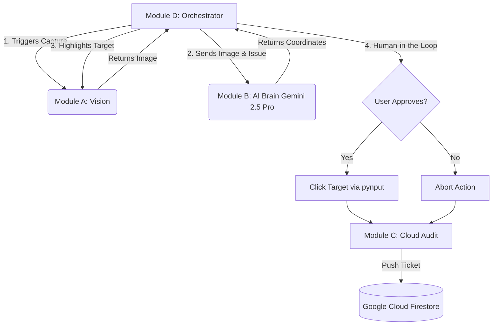

# Glass Box IT Agent

A multimodal, Human-in-the-Loop (HITL) AI troubleshooting assistant designed to solve Level 1 IT issues with complete transparency. Built for the Gemini Live Agent Challenge.

## How It Works
Unlike "black box" agents that take over a machine without explanation, the Glass Box Agent visually identifies UI elements using Gemini Vision, explicitly highlights its intended action on-screen, and waits for user authorization before executing physical hardware clicks. All actions are audited to a Google Cloud Firestore backend.

## Architecture

## Setup Instructions

1. Clone the Repository:
    git clone https://github.com/ItsReallyDanii/GlassBox_Agent.git
cd GlassBox_Agent

2. Set up the Virtual Environment:
    python -m venv venv
    .\venv\Scripts\activate

3. Install Dependencies:
pip install mss google-genai pynput firebase-admin

4. Configuration:

    Add your Gemini API Key to module_b_brain.py.

    Place your Firebase serviceAccountKey.json in the root directory for cloud telemetry.

5. Run the Agent:
    python src/module_d_controller.py
