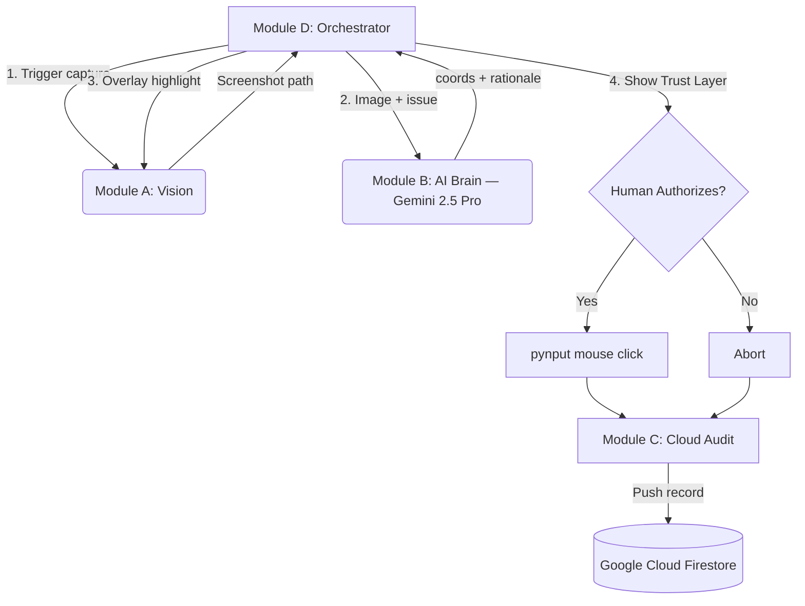

# Glass Box IT Agent

> A multimodal, Human-in-the-Loop (HITL) UI Navigator for Level 1 IT support.  
> Built for the **Gemini Live Agent Challenge**.

---

## What It Does

Most AI agents are "black boxes" — they take over your machine and act without explanation.  
**Glass Box** is different. It:

1. **Captures** your screen with a single keystroke.
2. **Analyzes** the screenshot with **Gemini 2.5 Pro** to locate the exact UI element that resolves your issue.
3. **Highlights** the target on-screen using a transparent red overlay (the "glass box").
4. **Explains** its reasoning — showing you the element name and *why* it chose it before doing anything.
5. **Waits** for your explicit authorization before executing a single mouse click.
6. **Logs** every action — authorized or rejected — to **Google Cloud Firestore** for a full audit trail.

---

## Architecture



| Module | File | Responsibility |
|--------|------|----------------|
| A | `src/module_a_vision.py` | `mss` screenshot · `tkinter` glass box overlay |
| B | `src/module_b_brain.py` | Gemini 2.5 Pro multimodal · returns JSON coords + rationale |
| C | `src/module_c_cloud.py` | Firestore audit log (graceful simulation if creds absent) |
| D | `src/module_d_controller.py` | Orchestrator · HITL gate · `pynput` click execution |

---

## Tech Stack

| Layer | Technology |
|-------|-----------|
| AI Model | Gemini 2.5 Pro (`gemini-2.5-pro`) |
| AI SDK | Google GenAI Python SDK (`google-genai`) |
| Google Cloud Service | **Google Cloud Firestore** (audit log for every agent action) |
| Screen Capture | `mss` |
| UI Overlay | `tkinter` (stdlib) |
| Mouse Control | `pynput` |

---

## Proof of Google Cloud Usage

Module C (`src/module_c_cloud.py`) writes a structured document to the **`IT_Tickets`** Firestore collection on every run. Each document contains:

```json
{
  "timestamp": "2025-07-01T12:00:00Z",
  "user_issue": "I can't find the finish button.",
  "target_element": "Submit / Finish button",
  "ai_rationale": "This is the primary CTA for completing the application.",
  "action_coords": { "x": 1102, "y": 847, "width": 120, "height": 40 },
  "human_authorized": "AUTHORIZED"
}
```

If `serviceAccountKey.json` is absent, the agent prints a **simulated payload** locally so the flow can be tested end-to-end without cloud credentials.

---

## Setup

### 1. Clone

```bash
git clone https://github.com/ItsReallyDanii/GlassBox_Agent.git
cd GlassBox_Agent
```

### 2. Virtual Environment

```bash
python -m venv venv
# Windows
.\venv\Scripts\activate
# macOS / Linux
source venv/bin/activate
```

### 3. Install Dependencies

```bash
pip install -r requirements.txt
```

### 4. Configure Secrets

| Secret | How |
|--------|-----|
| Gemini API Key | Set environment variable: `set GOOGLE_API_KEY=your_key` (Windows) / `export GOOGLE_API_KEY=your_key` (macOS/Linux) |
| Firebase credentials | Place `serviceAccountKey.json` in the repo root (optional — agent runs in simulation mode without it) |

### 5. Run

```bash
python src/module_d_controller.py
```

---

## Devpost Submission Copy

### Short Description
Glass Box is a transparent, Human-in-the-Loop IT support agent. It uses Gemini 2.5 Pro to analyze your screen, visually highlights its intended action with a red overlay, explains its reasoning in plain English, and only acts after you approve — logging every decision to Google Cloud Firestore.

### Features & Functionality
- **Multimodal AI reasoning** — Gemini 2.5 Pro interprets live screenshots to locate any UI element by natural language description.
- **On-screen Trust Layer** — A semi-transparent red "glass box" shows exactly where the agent intends to click. No surprises.
- **Human-in-the-Loop gate** — The agent is physically incapable of clicking without explicit terminal authorization on every single action.
- **Immutable audit trail** — Every action (authorized or rejected), the AI's rationale, and the target coordinates are written to Google Cloud Firestore in real time.
- **Graceful degradation** — Works locally without Firebase credentials; simulates cloud logging so the full flow is always testable.

### Technologies Used
- Gemini 2.5 Pro via Google GenAI Python SDK
- Google Cloud Firestore
- Python · mss · tkinter · pynput

### Data Sources
None — the agent operates entirely on live screen captures taken locally on the user's machine. No external data sources or pre-collected datasets are used.

### Challenges & Learnings
- Coordinating a blocking `tkinter` overlay with a terminal-driven HITL prompt required careful sequencing so the highlight is visible *before* the authorization question appears.
- Prompting Gemini to return consistent, type-safe JSON bounding boxes (not normalized 0–1000 ratios) required explicit schema enforcement and a post-parse guardrail layer.
- Designing for "no credentials" graceful fallback made local development significantly smoother and the project more accessible for judges to run.

---

## License

MIT
